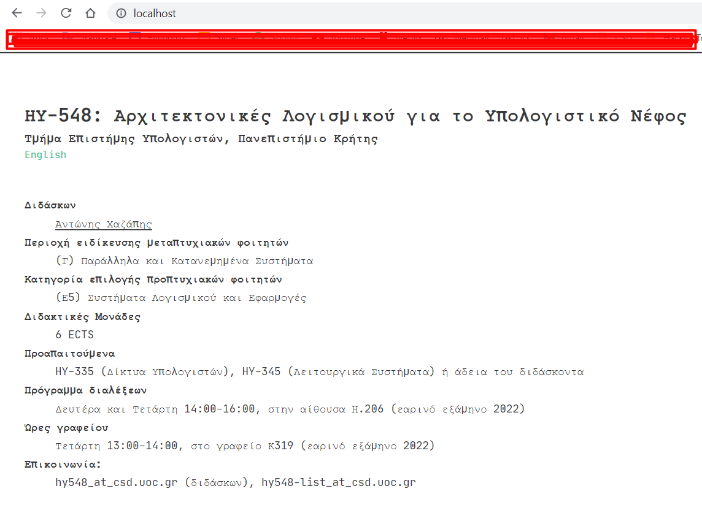

# Homework 1

## 1.

### a.
To download an image you need to do docker pull image_name:image_tags so to download this images:

` docker pull nginx:1.21.6 `

` docker pull nginx:1.21.6-alpine`

### b.
nginx:1.21.6 size: 141.51

nginx:1.21.6-alpine 23.43

The alpine is much smaller from nginx I believe this is because alpine is designed to be small. 


### c.

` docker run -d  --name johnginx -p 80:80 nginx:1.21.6 `

`curl localhost:80 >index.html `

index.html works so does the http://localhost:80 and both return html code


### d.

`docker ps`


### e.

`docker container logs johnginx`


### f.
To stop the cointainer:  `docker stop johnginx`

### g.
To start the cointainer: `docker start johnginx`

### h.

To stop and delete the container:

`docker stop johnginx`

`docker rm johnginx`

## 2.

### a.

` docker run -d  --name johnginx -p 80:80 nginx:1.21.6 `

For a shell session:

` docker exec -it johnginx bash `

To install nano so I can change index.html:

` apt-get update `
` apt-get install nano`

To change the index.html:

`nano /usr/share/nginx/html/index.html`


### b. 

To get the default page:

`curl localhost:80 > index.html`

To overwrite the default page with mine:

`cp test.html johnginx:/usr/share/nginx/html/index.html`


`docker stop johnginx`

`docker rm johnginx`

` docker run -d  --name johnginx -p 80:80 nginx:1.21.6 `

### c.
The changes are gone because this is a new container nothing has been saved from the old one.

## 3

On my windows machine

```
git clone --recurse-submodules https://github.com/chazapis/hy548.git

cd hy548/html

hugo -D

docker cp public/. johnginx:/usr/share/nginx/html/ 
```




## 4

### a
My Dockerfile

```
FROM nginx:1.21.6-alpine

MAINTAINER Arakas Ioannis johnarkas679@gmail.com
    # installing the packages tha I need
RUN apk add hugo &&\
    apk add git &&\
    # cloning the project
    cd /usr/share/nginx/html  &&\ 
    git clone --recurse-submodules https://github.com/chazapis/hy548.git &&\ 
    cd hy548/html &&\ 
    # to build the project
    hugo -D &&\ 
    # overwrite the old image with new one
    mv /usr/share/nginx/html/hy548/html/public/* /usr/share/nginx/html/.  &&\ 
    # to remove the packages
    apk del hugo  &&\ 
    apk del git

```
### b
To upload my image I did

`docker container commit d884cf8f11c2 johnarakas/hy548`

`docker image push johnarakas/hy548`

To pull

`docker pull johnarakas/hy548:latest`


### c
I use nginx:1.21.6-alpine is realy small and ready to use for websites

Original Size: 23.4 MB

New size: 46.1 MB

### d
I use only one RUN and mutiple &&\ I also delte the installations packets of hugo and git finaly I try to delete the repo but that cause probles. 


## 5

My yaml file

```
name: Build and Publish

on:
  # run it on push to the default repository branch
  push:
    branches: [main]


jobs:
  # define job to build and publish docker image
  build-and-push-docker-image:
      name: Buildand push to  Docker image 
      runs-on: ubuntu-latest

      steps:

        - name: Checkout code
          uses: actions/checkout@v2


        # setup Docker buld action
        - name: Set up Docker Buildx
          id: buildx
          uses: docker/setup-buildx-action@v1


        - name: Login to DockerHub
          uses: docker/login-action@v1
          with:
            username: ${{ secrets.DOCKERHUB_USERNAME }}
            password: ${{ secrets.DOCKERHUB_TOKEN }}
            
            
        - name: Build and Push
          uses: docker/build-push-action@v2
          with:
           
            context: ./Homework1
            # Note: tags has to be all lower-case
            tags: johnarakas/hy548:latest 
            # build on feature branches, push only on main branch
            push: ${{ github.ref == 'refs/heads/main' }}

```


