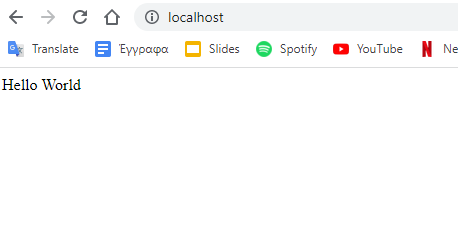

# Homework 2

## 1

### 1 a.

The yaml file I will need is :

``` yaml

apiVersion: v1
kind: Pod
metadata:
  name: demo
spec:
  containers:
  - name: nginx
    image: nginx:1.21.6-alpine
    ports:
    - containerPort: 80
      name: http
      protocol: TCP

```

The commands are :

To start minikube:  ` minikube start `

To start the pod: `kubectl apply -f Homework2_1.yaml`


### 1 b.
To forward the pod to port 80: `kubectl port-forward demo 80:80`
To copy the nginx default page: `curl localhost:80 > index.html`

### 1 c.

To print the logs: `kubectl logs demo`

### 1

To open a session: `kubectl exec -it demo -- /bin/sh `

To install nano so you can edit index.html:

`apk update`

`apk add nano`

To chande index.html: ` nano /usr/share/nginx/htmlindex.html`


### 1e.

To download the default page: `curl localhost:80 > index`

To place hello.html as default page: `kubectl cp hello.html demo:/usr/share/nginx/html/index.html`




### 1d.

To stop and delete ` kubectl delete pod demo`


