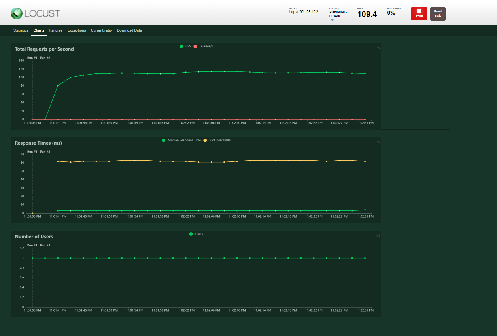

# Homework 3

## 1

### 1.1

My Docker file

```
FROM python:3.10.3-slim

RUN pip install Flask==2.0.3
ENV MESSAGE "wazzaaaaa"

COPY . /app
WORKDIR /app

CMD python hello.py
```

My Python file

```
from flask import Flask 
import os
app = Flask(__name__)

@app.route('/')

def index():
    return os.environ['MESSAGE']
    

app.run(debug=True,host='0.0.0.0', port=8080)
```

To build my image :


To compile my code :

` docker run -d -p 8080:8080 --name homework3-1.1 b58c64596846 `

To push my code :

` docker tag homework3-1.1 johnarakas/homework3-1.1:homework3-1.1-tag `

` docker push johnarakas/homework3-1.1:homework3-1.1-tag `


### 1.2 

My python file

```

from flask import Flask
import os
app = Flask(__name__)

@app.route(os.environ['ROUTE'])
def index():
    return os.environ['MESSAGE']

    
app.run(debug=True,host='0.0.0.0', port=8080)


```

My first Yaml

```
apiVersion: networking.k8s.io/v1
kind: Ingress
metadata:
  name: flask-ingress-first
spec:
  rules:
  - http:
      paths:
      - path: /first
        pathType: Prefix
        backend:
          service:
            name: first
            port:
              number: 8080
---
apiVersion: v1
kind: Service
metadata:
  name: first
spec:
  type: ClusterIP
  ports:
  - port: 8080
  selector:
    app: first
---


apiVersion: apps/v1
kind: Deployment
metadata:
  name: first
spec:
  replicas: 1
  selector:
    matchLabels:
      app: first
  template:
    metadata:
      labels:
        app: first
    spec:
      containers:
      - name: hw3
        image: johnarakas/hw:hw-tag
        env:
        - name: MESSAGE
          value: "This is the first service"
        - name: ROUTE
          value: /first

```


My second yaml

```

apiVersion: networking.k8s.io/v1
kind: Ingress
metadata:
  name: flask-ingress-second
spec:
  rules:
  - http:
      paths:
      - path: /second
        pathType: Prefix
        backend:
          service:
            name: second
            port:
              number: 8080
---
apiVersion: v1
kind: Service
metadata:
  name: second
spec:
  type: ClusterIP
  ports:
  - port: 8080
  selector:
    app: second
---


apiVersion: apps/v1
kind: Deployment
metadata:
  name: second
spec:
  replicas: 1
  selector:
    matchLabels:
      app: second
  template:
    metadata:
      labels:
        app: second
    spec:
      containers:
      - name: hw3
        image: johnarakas/hw:hw-tag
        env:
        - name: MESSAGE
          value: "This is the second service"
        - name: ROUTE
          value: /second
```

The commands for running are :

```
minikube start --kubernetes-version=1.22.4 --extra-config=kubelet housekeeping-interval=10s

minikube addons enable ingress

minikube apply -f first.yaml
minikube apply -f first.yaml

kubectl port-forward first-5c98c566db-vbxnr 8080:8080

kubectl port-forward second-85fdccf6d6-htb8t 8090:8080


curl localhost:8080/first
curl localhost:8090/second


```


## 2

My yaml file

```
apiVersion: networking.k8s.io/v1
kind: Ingress
metadata:
  name: flask-ingress-first
spec:
  rules:
  - http:
      paths:
      - path: /first
        pathType: Prefix
        backend:
          service:
            name: first
            port:
              number: 8080


---
apiVersion: v1
kind: Service
metadata:
  name: first
spec:
  type: ClusterIP
  ports:
  - port: 8080
  selector:
    app: first
---

apiVersion: autoscaling/v1
kind: HorizontalPodAutoscaler
metadata:
  name: first
spec:
  minReplicas: 1
  maxReplicas: 8
  scaleTargetRef:
    apiVersion: apps/v1
    kind: Deployment
    name: first
  targetCPUUtilizationPercentage: 80


---


apiVersion: apps/v1
kind: Deployment
metadata:
  name: first
spec:
  replicas: 1
  selector:
    matchLabels:
      app: first
  template:
    metadata:
      labels:
        app: first
    spec:
      containers:
      - name: hw3
        image: johnarakas/hw:hw-tag
        env:
        - name: MESSAGE
          value: "This is the first service"
        - name: ROUTE
          value: /first
        resources:
          limits:
            cpu: "200m"
            memory: "256Mi"

```


Using locust I run benchmarks for 1 nad 100 user/s

For 1 user





For 100 users


